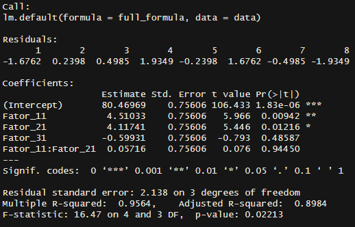
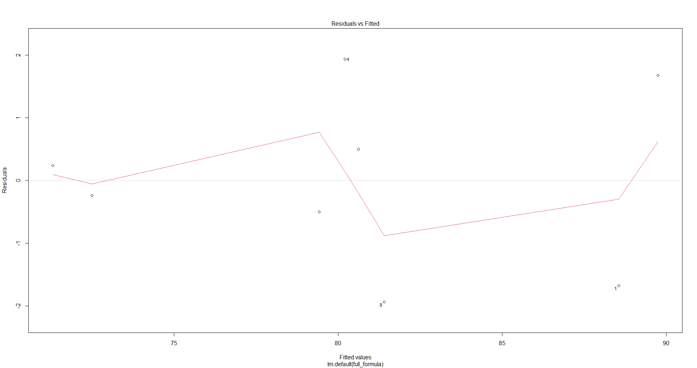
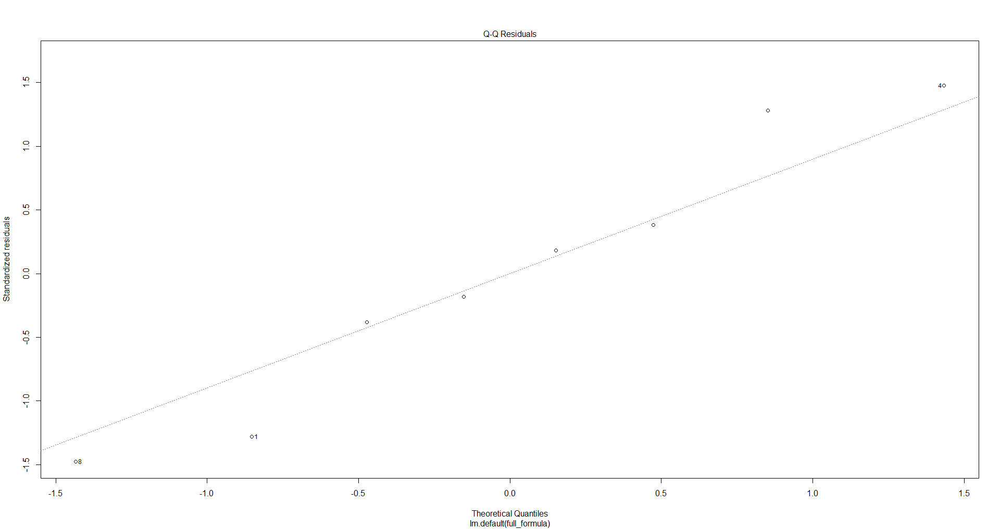

# 🧪 doe-pharma

**Design and analysis of experiments for process validation in pharmaceutical and manufacturing industries.**

`doe-pharma` is a set of R functions designed to plan, analyze, and interpret process validation experiments — such as sterilization, blending homogeneity, drying, filtration, and others — with a focus on regulatory compliance (ICH Q8, FDA 21 CFR Part 11, ISO 13485). Unlike most DOE packages in R, which are geared toward academic research, this project is specifically built for regulated industrial applications.**.

---

## 🎯 Key Features

- ✅ **Fractional factorial design** (`FrF2`) with resolution control.
- ✅ **Response Surface Design** (RSM/CCD) for process optimization.
- ✅ **Robust statistical analysis** using linear models (`lm`) and diagnostic plots.
- ✅ **Automatic factor coding** as `-1` / `+1` (industry standard).
- ✅ **Regulatory-ready outputs**: results formatted for validation reports.

---

## 🚀 Example: Blend Homogeneity Validation

library(doe-pharma)

### 1. Plan a 2^(4-1) design (4 factors, Resolution IV):

plano <- design_frf2(factors = 4, resolution = 4)

### 2. Simulate response (% homogeneity):

set.seed(123)
plano$Homogeneidade <- 80 + 
  5 * as.numeric(as.character(plano$Fator_1)) + 
  3 * as.numeric(as.character(plano$Fator_2)) + 
  rnorm(nrow(plano), sd = 2)

### 3. Analyze the experiment:

resultado <- analyze_doe(
  data = plano,
  response = "Homogeneidade",
  model_formula = "Fator_1 + Fator_2 + Fator_3"
)

### 4. Visualize results:

print(resultado$summary)
print(resultado$tidy_coefficients)
plot(resultado$model, which = 1:2)  # Diagnósticos: Resíduos e Q-Q

---

## 🖼️ Example Output

### Model Summary

> Validation report interpretation:

- Factor 1 shows a highly significant effect (p = 0.009) on homogeneity.

- Factor 2 is also significant (p = 0.012).

- Factor 3 is not statistically significant (p = 0.48) → can be fixed at any operational level.

- The model explains 95.6% of the variance (R² = 0.956), indicating excellent predictive capability.
Residual diagnostics (see below) confirm normality and homoscedasticity.

### Residual Diagnostics

  
*Figure 1: Residuals vs Fitted — no systematic pattern observed.*

  
*Figure 2: Q-Q Plot — residuals closely follow the ideal line.*

---

## 📚 Regulatory Context

> This project supports best practices outlined in:

- ICH Q8 (R2) – Pharmaceutical Development
- FDA Guidance for Industry – Process Validation
- EU GMP Annex 15 – Qualification and Validation
- ISO 13485 – Medical devices quality management

